# Explore Asturias
Explore Asturias app has been built to introduce the world to the region in Spain where I am originally from. This app will help you understand its history, discover its cuisine and landscapes, and find nearby locations if you are visiting Asturias, thanks to its map.

---
## User Histories

### First Time Visitor Goals:
  * **As a first-time visitor**, I want to easily understand the main purpose of this app, which is to discover and know where Asturias is.
  * **As a First Time Visitor**, I want to be able to easily navigate through the app, so I can find the content.
  * **As a first-time visitor**, I want to be left with the feeling of wanting to visit Asturias.

### Returning Visitor Goals:
 * **As a returning visitor**, I want to delve deeper into the beauty and culture of Asturias.
### Frequent Visitor Goals:
  * **As a frequent visitor**, I want to access current weather conditions, forecasts, helping me plan my activities effectively during each visit.
  * **As a frequent visitor**, I want an interactive map including points of interest.

## Features

  + ### Landing Page:
    - **Represents:**
      * The entry point for Explore Asturias.

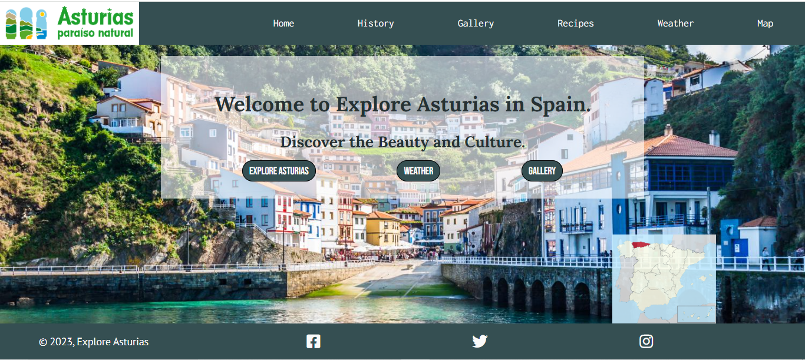
    - It has:
      * A navigation bar with links that lead us to each of the different pages of the application. 
      * The official tourism logo of Asturias.
      * Three buttons that redirect us to the three main features of the application: map, gallery of images, and weather app.
      * A footer with links to social media plattforms.

  + ### All Pages:
    - All the pages have in common:
      * A navigation bar with links that lead us to each of the different pages of the application. 
      * The official tourism logo of Asturias.
      * A footer with links to social media plattforms.
  + ### History Page:
    - It has: 
      * Cards:
        * The front side displays an image representing the historical period featured on the card.
        * The back side contains a brief summary of the history of Asturias during that period.
        * The back side contains a custom scroll bar.

        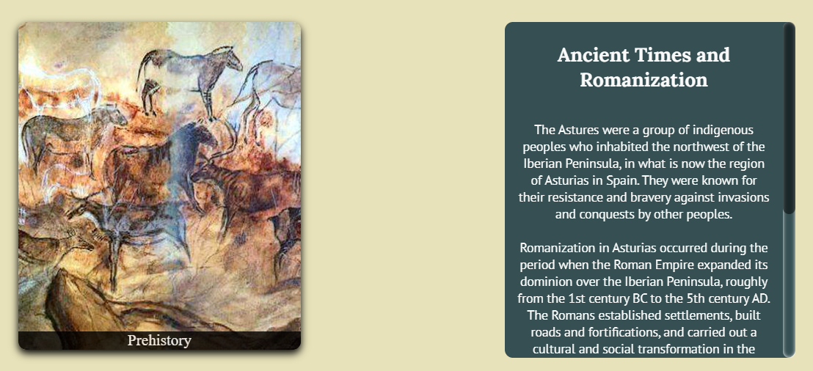
      
  + ### Gallery Page:
    - It has: 
      * Carousel of images:
        * Each image has a title explain what the image is.
        * On the left side of carusel, there is an arrow
        * On the right side of the carousel, there is an arrow that takes you to the next image. 
        * There is a progress bar above the images, which, in a bluish color, shows the progress within the carousel.
        * You can navigate through the images using the left and right arrow keys on the keyboard.
        * After 9 seconds, the carousel automatically moves to the next image.

        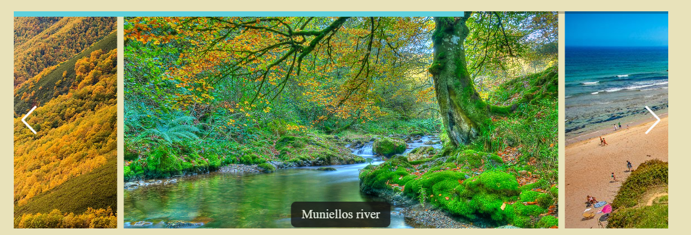

  + ### Recipes Page:
    - It has: 
      * Three typical recipes from Asturian cuisine.
      * Each recipe is presented with the dish's name, a brief description, an image, and a button that, when clicked, displays the recipe.

      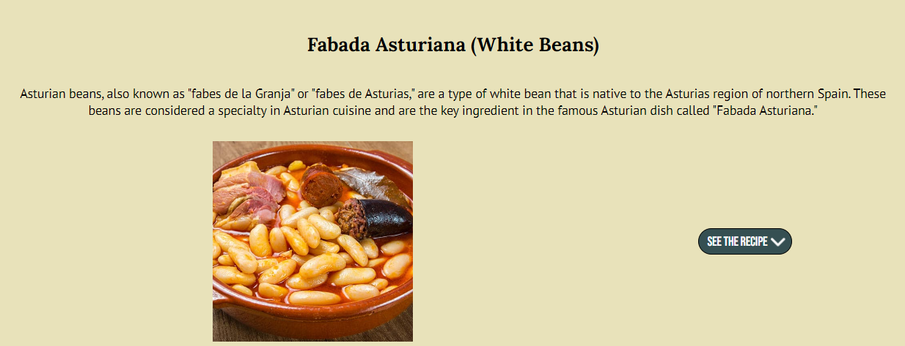

      * When clicked, it displays the recipe with the steps to follow. This new container includes a close button.
      
      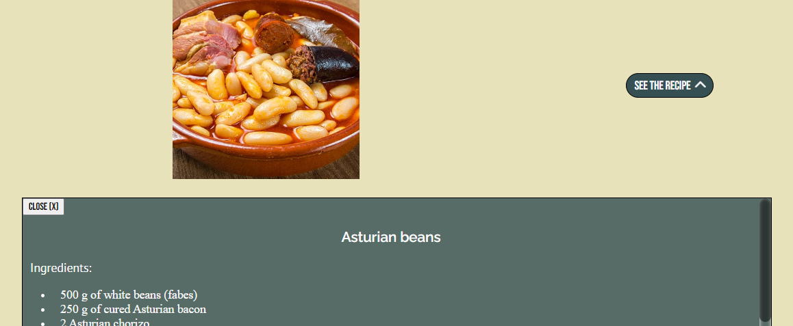

      * The 'see the recipe' button is interactive, and its icon changes depending on whether the recipe is shown or not.

      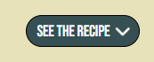
      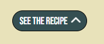

  + ### Weather Page:

    - It has:
      * On the left side, it shows the current weather conditions at the location where we are.

      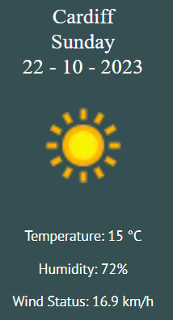

      * On the right side, it provides the weather information for the two main cities in Asturias for the next two days. 

      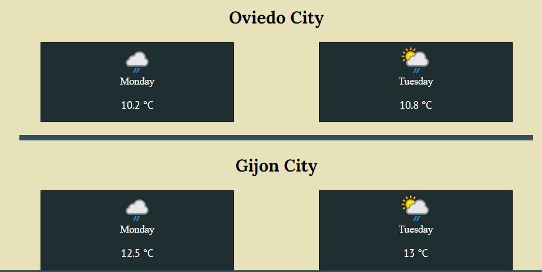

  + ### Map Page:

      - It has:
        * An interactive map, the current position of the user is marked.

        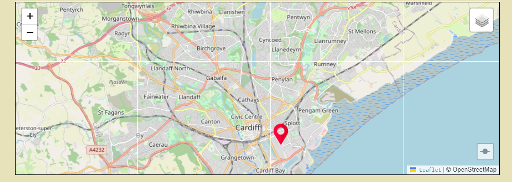

        * A button that takes you to Asturias, where points of interest are displayed.

        
        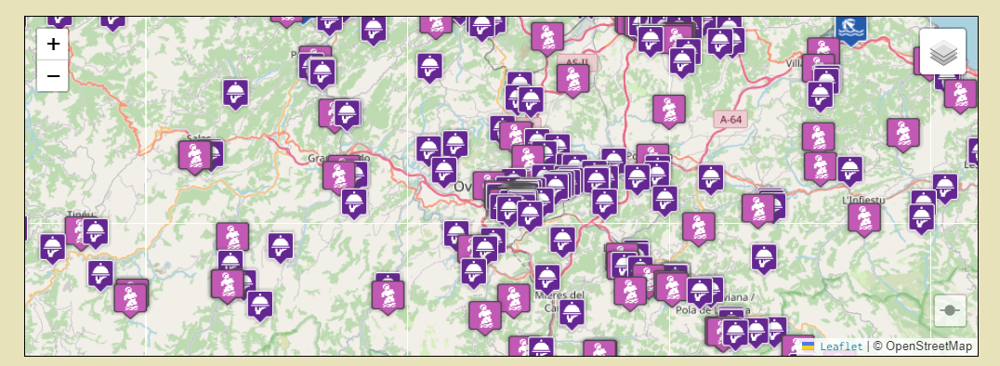

        * The map legend that is displayed and collapses automatically for easier map viewing.

        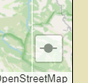

        * The different points of interest that can be marked and unmarked by the user and collapse for easier map viewing.

        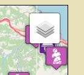

---

## Techonlogies Used

  * [HTML](https://developer.mozilla.org/en-US/docs/Web/HTML): was used as the structure of the site.
  * [CSS](https://developer.mozilla.org/en-US/docs/Web/CSS) - was used to add the styles, responsivness and layout of the site.
  * [JavaScript](https://developer.mozilla.org/en-US/docs/Web/JavaScript) - was used to add interactivity to the site.
  * [Figma](https://www.figma.com) - was used for predesign and wireframes of the site.
  * [VS Code](https://code.visualstudio.com/) - was used as the main tool to write and edit code.
  * [Git](https://git-scm.com/) - was used for the version control of the website.
  * [GitHub](https://github.com/) - was used to host the code of the website.
  * [Leaflet](https://leafletjs.com/reference.html) - Leaflet is an open source JavaScript library used to build web mapping applications.
  * [Leaflet Legend](https://github.com/ptma/Leaflet.Legend) - Leaflet.Legend is a plugin for Leaflet that display legend symbols and toggle overlays. 
  * [WeatherAPi](https://www.weatherapi.com/) - Weather Api is an application programming interface (API) that allows weather data to be queried from scripts and code.
  * [Swiper.js](https://swiperjs.com/) - Swiper is a JavaScript library that creates modern sliders.
  * [Font awsome](https://fontawesome.com/) - was used for add some icons to the site.
  * [Google Fonts](https://fonts.google.com/) - was used for fonts in the site.
---

## Design and Wirframes

### Design
  The design process was as follows: 
  * The first step, select the various colors that could match the website and carry out different tests on the background and buttons.
    * Possible colours and designs:

  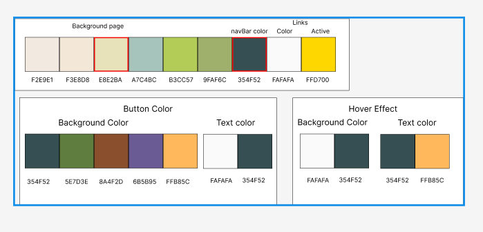
  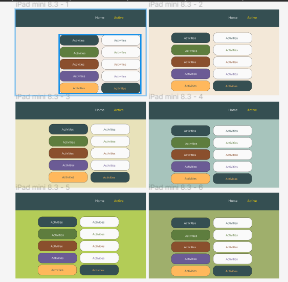

    * Definitive colours:

  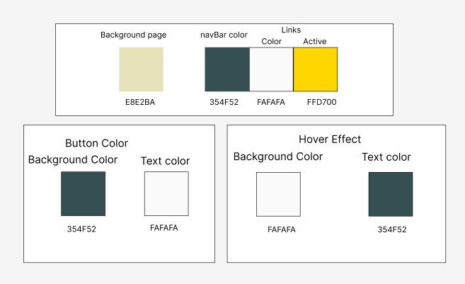

  * Second step, choose the font type for the text. [Google Fonts](https://fonts.google.com/) was used, and in the end, the following fonts were selected:
    * h1 and h2 - font-family: 'Lora', serif;
    * h3 and h4 - font-family: 'Raleway', sans-serif;
    * Links - font-family: 'Inconsolata', monospace;
    * Paragraphs - font-family: 'PT Sans', sans-serif;
    * Buttons - font-family: 'Bebas Neue', sans-serif;
    * History cards back title - font-family: 'Irish Grover', cursive;

  * The third step was to create the designs in [Figma](https://www.figma.com).  Some minor changes have been made to enhance the user experience.

### Wireframes

[Landing Page Figma](https://www.figma.com/file/43NJjlA5K4nUZqxGXWuRR4/Asturias---milestone-2?type=design&node-id=2%3A21&mode=design&t=x6t3HNe3Z4kc7SKo-1)

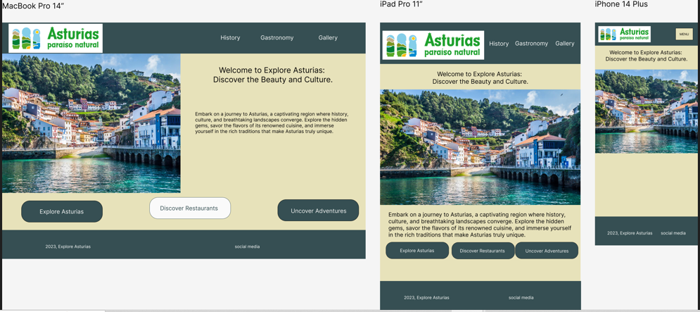

[History Figma](https://www.figma.com/file/43NJjlA5K4nUZqxGXWuRR4/Asturias---milestone-2?type=design&node-id=57%3A179&mode=design&t=x6t3HNe3Z4kc7SKo-1)

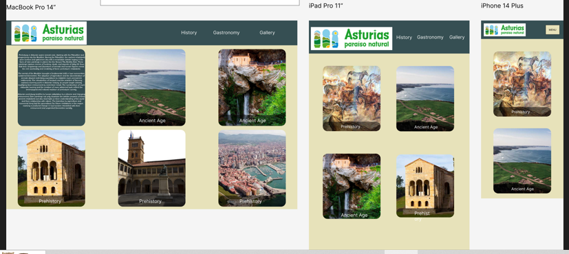

[Gallery Figma](https://www.figma.com/file/43NJjlA5K4nUZqxGXWuRR4/Asturias---milestone-2?type=design&node-id=2%3A113&mode=design&t=x6t3HNe3Z4kc7SKo-1)

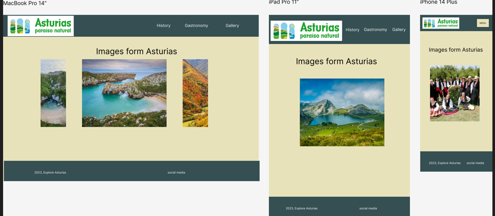

[Recipes Figma](https://www.figma.com/file/43NJjlA5K4nUZqxGXWuRR4/Asturias---milestone-2?type=design&node-id=0%3A1&mode=design&t=x6t3HNe3Z4kc7SKo-1)

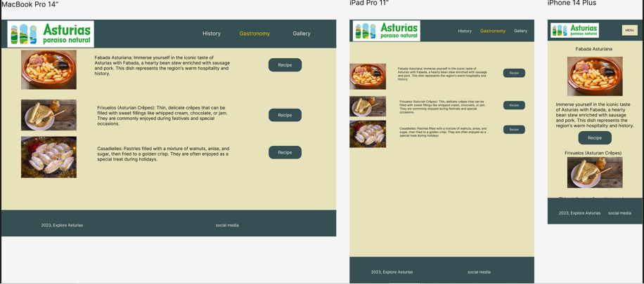

[Weather App Figma](https://www.figma.com/file/43NJjlA5K4nUZqxGXWuRR4/Asturias---milestone-2?type=design&node-id=2%3A37&mode=design&t=x6t3HNe3Z4kc7SKo-1)

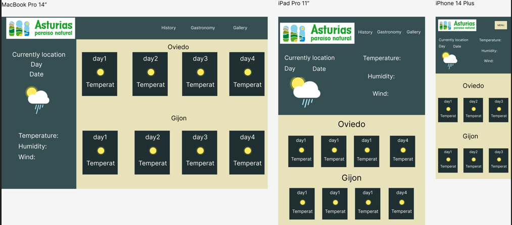

[Map Figma](https://www.figma.com/file/43NJjlA5K4nUZqxGXWuRR4/Asturias---milestone-2?type=design&node-id=2%3A187&mode=design&t=x6t3HNe3Z4kc7SKo-1)

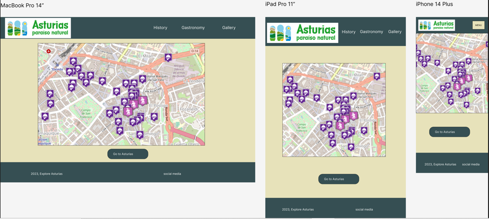
## Project Development

## Testing

## Deployment

## Credits

## Acknowledgements