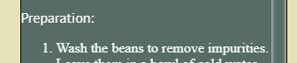

# Explore Asturias
Explore Asturias app has been built to introduce the world to the region in Spain where I am originally from. This app will help you understand its history, discover its cuisine and landscapes, and find nearby locations if you are visiting Asturias, thanks to its map.  

The site can be accessed by this [link](https://devjldp.github.io/CodeInstitute-Asturias/)

---
## User Histories

### First Time Visitor Goals:
  * **As a first-time visitor**, I want to easily understand the main purpose of this app, which is to discover and know where Asturias is.
  * **As a First Time Visitor**, I want to be able to easily navigate through the app, so I can find the content.
  * **As a first-time visitor**, I want to be left with the feeling of wanting to visit Asturias.

### Returning Visitor Goals:
 * **As a returning visitor**, I want to delve deeper into the beauty and culture of Asturias.
### Frequent Visitor Goals:
  * **As a frequent visitor**, I want to access current weather conditions, forecasts, helping me plan my activities effectively during each visit.
  * **As a frequent visitor**, I want an interactive map including points of interest.

## Features

  + ### Landing Page:
    - **Represents:**
      * The entry point for Explore Asturias.

    - It has:
      * A navigation bar with links that lead us to each of the different pages of the application. 
      * The official tourism logo of Asturias.
      * Three buttons that redirect us to the three main features of the application: map, gallery of images, and weather app.
      * A footer with links to social media plattforms.

  + ### All Pages:
    - All the pages have in common:
      * A navigation bar with links that lead us to each of the different pages of the application. 
      * The official tourism logo of Asturias.
      * A footer with links to social media plattforms.
  + ### History Page:
    - It has: 
      * Cards:
        * The front side displays an image representing the historical period featured on the card.
        * The back side contains a brief summary of the history of Asturias during that period.
        * The back side contains a custom scroll bar.

        
      
  + ### Gallery Page:
    - It has: 
      * Carousel of images:
        * Each image has a title explain what the image is.
        * On the left side of carusel, there is an arrow
        * On the right side of the carousel, there is an arrow that takes you to the next image. 
        * There is a progress bar above the images, which, in a bluish color, shows the progress within the carousel.
        * You can navigate through the images using the left and right arrow keys on the keyboard.
        * After 9 seconds, the carousel automatically moves to the next image.

        

  + ### Recipes Page:
    - It has: 
      * Three typical recipes from Asturian cuisine.
      * Each recipe is presented with the dish's name, a brief description, an image, and a button that, when clicked, displays the recipe.

      

      * When clicked, it displays the recipe with the steps to follow. This new container includes a close button.
      
      

      * The 'see the recipe' button is interactive, and its icon changes depending on whether the recipe is shown or not.

      
      

  + ### Weather Page:

    - It has:
      * On the left side, it shows the current weather conditions at the location where we are.

      

      * On the right side, it provides the weather information for the two main cities in Asturias for the next two days. 

      

  + ### Map Page:

      - It has:
        * An interactive map, the current position of the user is marked.

        

        * A button that takes you to Asturias, where points of interest are displayed.

        
        

        * The map legend that is displayed and collapses automatically for easier map viewing.

        

        * The different points of interest that can be marked and unmarked by the user and collapse for easier map viewing.

        

---

## Techonlogies Used

  * [HTML](https://developer.mozilla.org/en-US/docs/Web/HTML): was used as the structure of the site.
  * [CSS](https://developer.mozilla.org/en-US/docs/Web/CSS) - was used to add the styles, responsivness and layout of the site.
  * [JavaScript](https://developer.mozilla.org/en-US/docs/Web/JavaScript) - was used to add interactivity to the site.
  * [Figma](https://www.figma.com) - was used for predesign and wireframes of the site.
  * [VS Code](https://code.visualstudio.com/) - was used as the main tool to write and edit code.
  * [Git](https://git-scm.com/) - was used for the version control of the website.
  * [GitHub](https://github.com/) - was used to host the code of the website.
  * [Leaflet](https://leafletjs.com/reference.html) - Leaflet is an open source JavaScript library used to build web mapping applications.
  * [Leaflet Legend](https://github.com/ptma/Leaflet.Legend) - Leaflet.Legend is a plugin for Leaflet that display legend symbols and toggle overlays. 
  * [WeatherAPi](https://www.weatherapi.com/) - Weather Api is an application programming interface (API) that allows weather data to be queried from scripts and code.
  * [Swiper.js](https://swiperjs.com/) - Swiper is a JavaScript library that creates modern sliders.
  * [Font awsome](https://fontawesome.com/) - was used for add some icons to the site.
  * [Google Fonts](https://fonts.google.com/) - was used for fonts in the site.
---

## Design and Wirframes

### Design
  The design process was as follows: 
  * The first step, select the various colors that could match the website and carry out different tests on the background and buttons.
    * Possible colours and designs:

    
    

    * Definitive colours:

    

  * Second step, choose the font type for the text. [Google Fonts](https://fonts.google.com/) was used, and in the end, the following fonts were selected:
    * h1 and h2 - font-family: 'Lora', serif;
    * h3 and h4 - font-family: 'Raleway', sans-serif;
    * Links - font-family: 'Inconsolata', monospace;
    * Paragraphs - font-family: 'PT Sans', sans-serif;
    * Buttons - font-family: 'Bebas Neue', sans-serif;
    * History cards back title - font-family: 'Irish Grover', cursive;

  * The third step was to create the designs in [Figma](https://www.figma.com).  Some minor changes have been made to enhance the user experience.

### Wireframes

[Landing Page Figma](https://www.figma.com/file/43NJjlA5K4nUZqxGXWuRR4/Asturias---milestone-2?type=design&node-id=2%3A21&mode=design&t=x6t3HNe3Z4kc7SKo-1)

[History Figma](https://www.figma.com/file/43NJjlA5K4nUZqxGXWuRR4/Asturias---milestone-2?type=design&node-id=57%3A179&mode=design&t=x6t3HNe3Z4kc7SKo-1)

[Gallery Figma](https://www.figma.com/file/43NJjlA5K4nUZqxGXWuRR4/Asturias---milestone-2?type=design&node-id=2%3A113&mode=design&t=x6t3HNe3Z4kc7SKo-1)

[Recipes Figma](https://www.figma.com/file/43NJjlA5K4nUZqxGXWuRR4/Asturias---milestone-2?type=design&node-id=0%3A1&mode=design&t=x6t3HNe3Z4kc7SKo-1)

[Weather App Figma](https://www.figma.com/file/43NJjlA5K4nUZqxGXWuRR4/Asturias---milestone-2?type=design&node-id=2%3A37&mode=design&t=x6t3HNe3Z4kc7SKo-1)

[Map Figma](https://www.figma.com/file/43NJjlA5K4nUZqxGXWuRR4/Asturias---milestone-2?type=design&node-id=2%3A187&mode=design&t=x6t3HNe3Z4kc7SKo-1)

## Project Development
The project development followed the following steps: 
* pre-design of the app using Figma. 
* Next, practice of each of the features that the app was going to be composed of: (Todo el codigo esta en mi GitHub personal)
  * [Carousel](https://github.com/devjldp/courosel1) - [Live](https://devjldp.github.io/courosel1/)
  * [Weather App](https://github.com/devjldp/weatherApp) - [Live](https://devjldp.github.io/weatherApp/)
  * [Map](https://github.com/devjldp/leaflet-map) -[Live](https://devjldp.github.io/leaflet-map/)
  * [Flip Cards](https://github.com/devjldp/flip-cards-js) - [Live](https://devjldp.github.io/flip-cards-js/)

* After this, the only thing left was to put the pieces together in a first version of the app.
  * [Asturias](https://github.com/devjldp/asturias) - [Live](https://devjldp.github.io/asturias/)

The reason for this process is that I consider myself in the process of learning new technologies. The development of this learning method has allowed me to learn more about CSS and JavaScript, as well as all the mistakes I have made along the way. I can say that after this second milestone, I have acquired a more solid foundation in HTML, CSS, and JavaScript.

## Testing

  Please refer to the [TESTING.md](TESTING.md) file for all test-related documentation.

## Bugs

  ### Solved Bugs
  * The webpage occupies more than 100% of the screen on mobile devices.

    

    * Solution: Add margin 0% to class face

  * The hamburger menu is attached to the page logo when the screen size is less than 350px. 

    

    * Solution: Add padding left to the element

  * The dropdown menu remains visible when the screen size is less than 480px.

    

    * Solution: Decrease the top position

  * The dropdown menu hides the title h1.

    

    * Solution: Increase margin top element h1 / change font size
  
  * The dropdown menu remained fixed. 
  
    

    * Solution: Change its position from fixed to absolute 
  
  * The button doesn’t adapt to the text
  
    
    
    * Solution: Increase the width for mobile devices.
  
  * The button doesn’t have funcionality

    

    * Solution: Error in conditions if statements. Change the conditions
  
  * No padding in the elements inside recipe-stepscontainer. Poor user experience

    

    * Solution: Add padding to mobile devices media queries. 

  ### Unsolved bugs

  * The geolocation in the map is not accurate. There is an inaccuracy of several meters.

## Deployment
  * The site was deployed to GitHub pages. The steps to deploy are as follows:
    * In the [GitHub repository](https://github.com/devjldp/CodeInstitute-Asturias), navigate to the Settings tab
    * From the source section drop-down menu, select the Main Branch, then click "Save".
The page will be automatically refreshed with a detailed ribbon display to indicate the successful deployment.  
The live link can be found [here](https://devjldp.github.io/CodeInstitute-Asturias/)

## Credits

  * ### Images

    * **index:**  
      [cudillero](https://www.thetimes.co.uk/article/asturias-and-galicia-spains-sensational-north-m6xrf5bmc), [Asturias Logo](https://deporteasturiano.org/mas/logotipos/)

    * **History**  
      [Prehistoria](https://www.hoteles.net/asturias/ribadesella/cueva-tito-bustillo-ribadesela-asturias.html), [Ancient times](https://tusdestinos.net/gijon-romano-cimavilla-campa-torres-veranes/), 
      [Covadonga](https://www.turismocangasdeonis.com/covadonga.html), 
      [Middle ages](https://www.barcelo.com/guia-turismo/es/espana/asturias/que-ver/santa-maria-del-naranco/), 
      [Modern Era](https://www.gaudeo.es/lapis), [Contemporary Era](https://viajes.chavetas.es/guia/asturias/mejores-miradores-de-gijon/)

    * **Gallery**
      [Asturian costume](https://www.elcomercio.es/gijon/gijon-festeja-asturias-20180805224627-ga.html), [Bulnes village](https://www.iberian-escapes.com/picos-de-europa-national-park-guide.html#gallery[pageGallery]/2/), [Covadonga sanctuary](https://www.lavozdeasturias.es/noticia/asturias/2023/04/04/guia-completa-puedes-visitar-covadonga/00031680629223425336179.htm), [Sea cave](https://www.asturiasopinion.com/viajes/playa-de-cuevas-del-mar/), [Enol lake](https://www.iberian-escapes.com/picos-de-europa-national-park-guide.html#gallery[pageGallery]/2/), [Ercina lake](https://www.iberian-escapes.com/picos-de-europa-national-park-guide.html#gallery[pageGallery]/2/), [Gascona](https://www.facebook.com/photo/?fbid=559747256201116&set=a.559747196201122), [Gulpiyuri beach](https://viajar.elperiodico.com/escapate_cerca/playas-bonitas-asturias-paseo-belleza-85011625), [mine museum](https://www.tripadvisor.co.uk/Attraction_Review-g2695910-d2508969-Reviews-Museum_of_Mining_and_Industry-El_Entrego_San_Martin_del_Rey_Aurelio_Municipality.html),[Muniellos](https://www.traveler.es/naturaleza/articulos/visitar-el-bosque-reserva-de-muniellos-asturias-robledal-visitar-que-hacer/13713), [Muniellos river](https://www.traveler.es/naturaleza/articulos/visitar-el-bosque-reserva-de-muniellos-asturias-robledal-visitar-que-hacer/13713), [Penarronda beach](https://www.turismoasturias.es/-/blogs/12-playas-inolvidables-para-un-verano-en-asturias), [Picu Urriello](https://www.iberian-escapes.com/picos-de-europa-national-park-guide.html#gallery[pageGallery]/2/), [San Juan night](https://www.elcomercio.es/planes/hogueras-noche-san-juan-asturias-20220621215603-nt.html?ref=https%3A%2F%2Fwww.google.com%2F), [soton mine](https://machbel.com/viajes/espana/asturias/minas-visitar/), [Tierra Astur](https://www.turismoasturias.es/fr/organiza-tu-viaje/donde-comer/restaurantes/tierra-astur-gascona)

    * **Recipes**
      [Fabada](https://www.comedera.com/fabada-asturiana/), [Hake in cider](https://www.hogarmania.com/cocina/recetas/pescados-mariscos/merluza-sidra-asturiana-karlos-arguinano.html), [Frixuelos](https://www.20minutos.es/gastronomia/recetas/receta-frixuelos-menos-de-2-euros-dulce-tradicional-asturiano-5114936/) 
  
    * **Map Icons**  
      The were obtained from this [web](https://mapicons.mapsmarker.com/) 
  * ### Code

    * **leaflet.legend.js** This code is a plugin for leaflet and it was taken form [here](https://github.com/ptma/Leaflet.Legend)
    * **leaflet.legend.css** This code is a plugin for leaflet and it was taken form [here](https://github.com/ptma/Leaflet.Legend)
    * **history.js** This code was adapted for me, after watching a tutorial on [youtube](https://www.youtube.com/watch?v=QGVXmoZWZuw&ab_channel=TylerPotts)

    The rest of code was made for me studying more about JavaScript or follow the documentation of the libraries or APIs

    * **map.js** Leaflet documentation [here](https://leafletjs.com/examples/quick-start/)
    * **carousel.js** Swiper documentation [here](https://swiperjs.com/get-started)
    *  **weather.js** weatherapi documentation [here](https://www.weatherapi.com/docs/)
    *  **Async functions** Learning more about async and await [here](https://developer.mozilla.org/en-US/docs/Web/JavaScript/Reference/Statements/async_function)
    *  **Promises** Learning more about promises [here](https://developer.mozilla.org/en-US/docs/Learn/JavaScript/Asynchronous/Promises) 

    * **JSON file** The data in JSON format was downloaded from this [page](https://www.turismoasturias.es/en/open-data/catalogo-de-datos), and the required information was extracted into the 'data.json' file.

## Acknowledgements

  * **Iuliia Konovalova**: My mentor for her advices and guidance throughout this project. She has helped me to improve.
  * **Iris Smok**: Our cohort facilitator for her guidance and support throughout the course.
