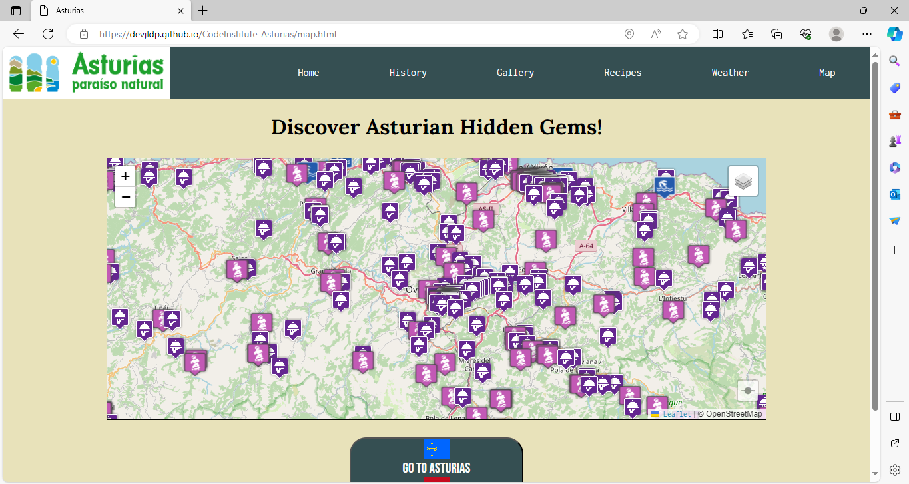

# Testing

## Compatibility

The website has been tested in the next browsers: Chrome, Edge and Opera

  * ### Chrome

  
  
  
  
  
  

 * ### Opera

  
  
  
  
  
  

 * ### Edge

  
  
  
  
  
    

## Devtools testing

  * The web was checked by devtools implemented on Firefox and Chrome browsers.

## Validator

  * ### HTML
    To validate the code, the official validator [W3C](https://validator.w3.org/) was used.  
    **Two errors were found and solved:**
      * Typography error: figcaptation instead of figcaption in history.html.
        * The solution was type it correctly. **figcaption**

        

      * Semantic error: button can not have a div as child.
        * The solution was change div for span

         

    After that all test were passed. Only info messages appears.

    * **Landing Page**

        

    * **History Page**

        

    * **Gallery Page**

        

    * **Recipe Page**

        

    * **Weather Page** 

        

    * **Map Page** 

        

  * ### CSS
    
    To validate css file, the official validator [W3C Jigsaw](https://jigsaw.w3.org/css-validator/) was used.
    **There was one error was found and solved**

      * Missing a unit after a number in a font-size property. Line 752
        * The solution was add units - rem

       

    After that no error were found.

    

  * ### JavaScript

    To validate code in JavaScript, the tool [JSHint](https://jshint.com/) was used.

    No errors were founded, only warnings. Mainly missing ";" and recommendation od using dot notation in objects.

    After solved this warning:

      * **carousel.js** - Warnings do not affect the execution of the code. The code was written following the library's documentation. [Swiper](https://swiperjs.com/get-started#install-from-npm)
    
      

      * **dropmenu.js**

      

      * **history.js** - Warnings do not affect the execution of the code.

      

      * **map.js** - Warnings do not affect the execution of the code. L undefined variable does not affect to the code. See Leaflet documentation [Leaflet](https://leafletjs.com/examples/quick-start/). Declaring a L variable crashes the code.

      

      * **recipe.js** - Warnings do not affect the execution of the code. 

      

      * **weather.js** - Warnings do not affect the execution of the code.
      
      

## Manual testing

  * Manual test with diferrent cases can find in the next **csv file**. [Manual test](documentation/manual_testing/manual_testing.csv)

## Acesibility and Performance

  Accessibility and performance were analyzed using Lighthouse in DevTools.

  * **index.html**

  

  * **history.html**

  

  * **gallery.html** 

  

  * **recipes.html**

  

  * **weather.html**    

  

  * **map.html**

  

